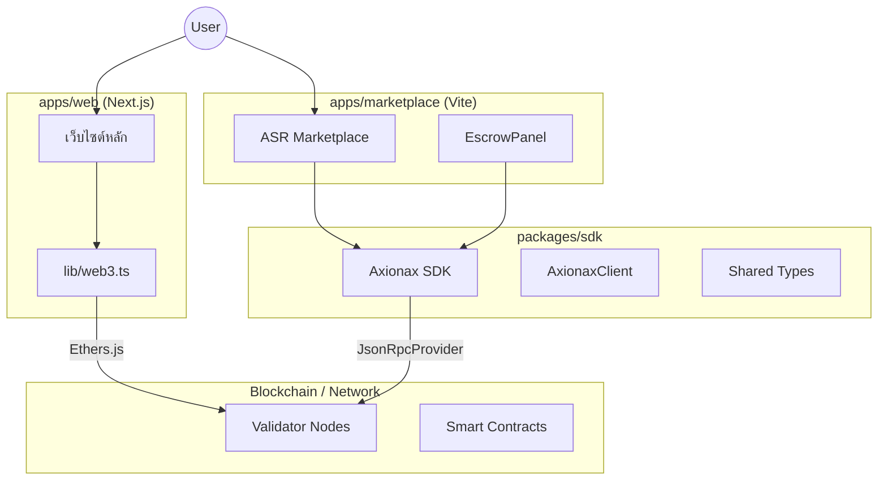

# รายงานสถาปัตยกรรมระบบ: axionax-web-universe

**วันที่:** 27 พฤศจิกายน 2025
**วิเคราะห์โดย:** Senior System Architect (Cline)
**ขอบเขต:** `apps/web`, `apps/marketplace`, `packages/sdk`

---

## 1. สถาปัตยกรรมระดับสูง (High-Level Architecture)

`axionax-web-universe` เป็น Monorepo ที่จัดการโดย **pnpm workspaces** ซึ่งออกแบบมาเพื่อแยกส่วน Core Logic (SDK) ออกจากส่วน User Interfaces (Web & Marketplace)

### องค์ประกอบหลัก:
1.  **`packages/sdk`**: เปรียบเสมือน "สมอง" เป็น Library TypeScript ที่รวบรวม Logic ในการติดต่อกับ Blockchain (Jobs, Workers, Escrow) ปัจจุบันทำงานใน **Mock Mode** แต่มีโครงสร้างพร้อมสำหรับสลับไปใช้ Real RPC
2.  **`apps/marketplace`**: เปรียบเสมือน "ผู้ใช้งาน" เป็น Client-side App (SPA) ที่สร้างด้วย Vite ทำหน้าที่ดึงความสามารถจาก SDK มาแสดงผล เช่น การเลือก Worker และการจัดการ Escrow
3.  **`apps/web`**: เปรียบเสมือน "หน้าตา" เป็น Server-Side Rendered (SSR) App ที่สร้างด้วย Next.js ใช้สำหรับเว็บไซต์หลักและเอกสาร ปัจจุบันจัดการการเชื่อมต่อ Web3 แยกเป็นอิสระจาก SDK

---

## 2. สรุป Tech Stack

| Workspace | Type | Framework / Library | Key Dependencies | State Management |
| :--- | :--- | :--- | :--- | :--- |
| **`apps/web`** | App | **Next.js 14** (App Router) | `ethers`, `react-query`, `zustand` | `zustand` + React Context |
| **`apps/marketplace`** | App | **Vite** + React | `@axionax/sdk`, `ethers`, `viem` | React `useState` / `useMemo` |
| **`packages/sdk`** | Lib | **TypeScript** | `ethers` | N/A (Stateless) |

*   **Styling**: ทุก Apps ใช้ **Tailwind CSS**
*   **Package Manager**: `pnpm` (จัดการ Dependencies ได้อย่างมีประสิทธิภาพ)

---

## 3. การวิเคราะห์ Data Flow

### A. Marketplace (SDK Integration)
Marketplace พึ่งพา SDK เป็นหลักในเรื่อง Business Logic
1.  **Input**: ผู้ใช้เลือก Worker และฝากเงินผ่าน `EscrowPanel`
2.  **Process**:
    *   `EscrowPanel` สร้าง Instance ของ `AxionaxClient`
    *   เรียกคำสั่ง `client.depositEscrow(jobId, amount)`
    *   **SDK Logic**: ปัจจุบันส่งคืน **Mock Transaction** กลับมาทันที
3.  **Output**: UI อัปเดตสถานะเป็น "Deposited" ตามข้อมูลที่ได้จาก SDK
    *   *อนาคต*: SDK จะทำการ Sign Transaction -> ส่งไปที่ RPC -> รอ Block Confirmation

### B. Website (Direct Web3)
เว็บไซต์จัดการการเชื่อมต่อ Blockchain โดยตรง ไม่ผ่าน SDK
1.  **Input**: ผู้ใช้กดปุ่ม "Connect Wallet"
2.  **Process**:
    *   `Web3Context` เรียกฟังก์ชัน `connectWallet()` จาก `lib/web3.ts`
    *   ใช้ `window.ethereum` เพื่อขอสิทธิ์เข้าถึงบัญชี
    *   มีการ Hardcode RPCs: `https://axionax.org/rpc/`, `http://217.76.61.116:8545`
3.  **Output**: สถานะของแอป (`account`, `balance`) จะถูกอัปเดตผ่าน `zustand` หรือ Context

---

## 4. การประเมินคุณภาพโค้ด (Code Quality Assessment)

### จุดแข็ง (Strengths)
*   ✅ **Monorepo Structure**: มีการแยกส่วน Apps และ Packages อย่างชัดเจน ทำให้สามารถดูแลรักษาและ Publish SDK แยกได้ง่าย
*   ✅ **Type Safety**: มีการใช้ TypeScript interfaces อย่างครอบคลุม (`Job`, `Worker`, `EscrowTransaction`) ทำให้ข้อมูลมีความถูกต้องตรงกันทั้งระบบ
*   ✅ **Modern Stack**: การใช้ Next.js 14 และ Vite ถือเป็นมาตรฐานที่ดีที่สุดในปัจจุบัน

### จุดที่ควรปรับปรุง (Areas for Improvement)
*   ⚠️ **Logic Duplication**: `apps/web` มีการเขียน Logic การเชื่อมต่อ Wallet เอง (`lib/web3.ts`) ซึ่งซ้ำซ้อนกับสิ่งที่ SDK *ควร* จะทำ ทำให้มีจุดที่ต้องแก้ไข RPC URL ถึง 2 แห่ง
*   ⚠️ **Hardcoded Config**: มีการฝัง RPC URL ไว้ในโค้ด (`apps/web/src/lib/web3.ts` และ `apps/marketplace/src/components/EscrowPanel.tsx`)
*   ⚠️ **Mock Dependency**: Marketplace ทำงานได้สมบูรณ์แต่ยังพึ่งพา Mock Data ใน SDK การจะใช้งานจริงต้องเขียน Logic ใน SDK เพิ่มเติม

---

## 5. ข้อเสนอแนะ (Recommendations)

1.  **รวมศูนย์ Web3 Logic**:
    *   ย้ายฟังก์ชัน `connectWallet`, `getBalance`, และ Chain Configuration จาก `apps/web/lib/web3.ts` เข้าไปไว้ใน `@axionax/sdk`
    *   ปรับให้ `apps/web` เรียกใช้ `@axionax/sdk` แทนการจัดการ `ethers` เองโดยตรง

2.  **Environment Variables**:
    *   ดึง RPC URLs (เช่น `http://46.250.244.4:8545`) ออกไปไว้ในไฟล์ `.env` หรือสร้างไฟล์ Config กลางใน SDK

3.  **พัฒนา SDK ให้สมบูรณ์**:
    *   เปลี่ยนโค้ดส่วน `// TODO` ใน `packages/sdk` ให้เป็นการเรียก Smart Contract จริง
    *   สิ่งที่ต้องมี: **Escrow Smart Contract ABI** และ **Deployed Address**

4.  **Shared UI Components**:
    *   พิจารณาสร้าง workspace `packages/ui` สำหรับเก็บ Component กลาง (เช่น ปุ่ม, การ์ด) เพื่อให้ดีไซน์ของ Web และ Marketplace เป็นไปในทิศทางเดียวกัน
