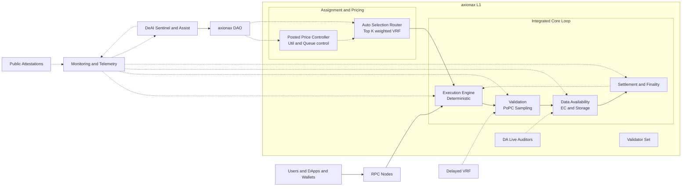
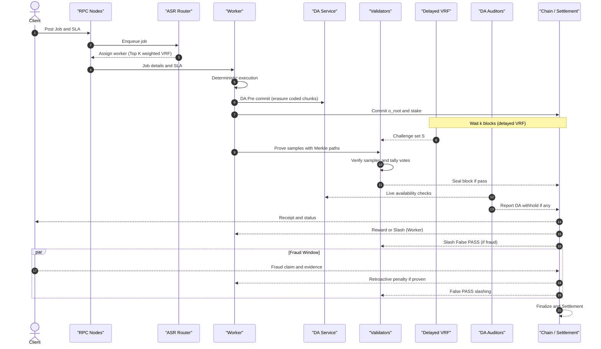
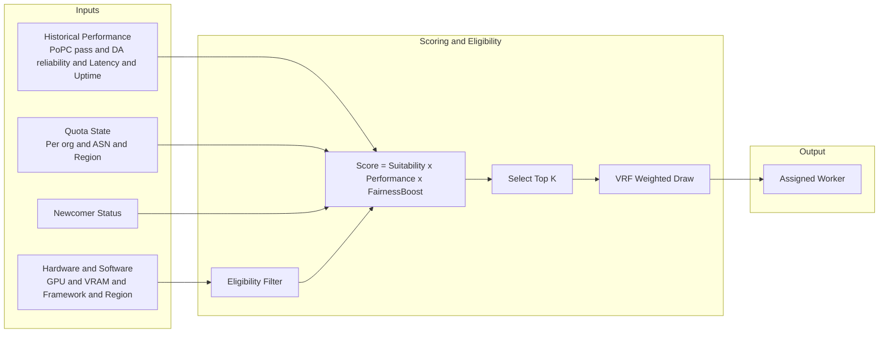
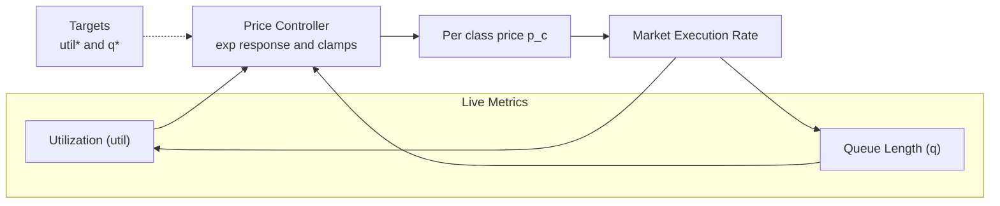
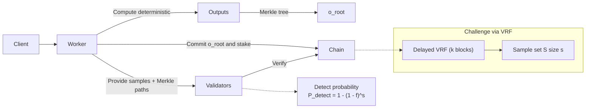
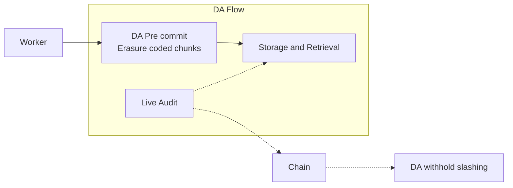
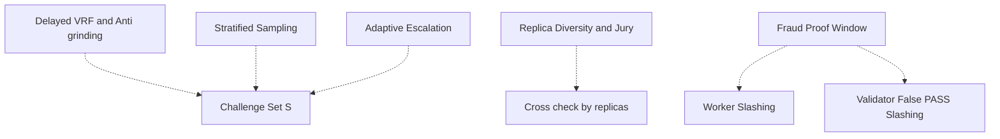
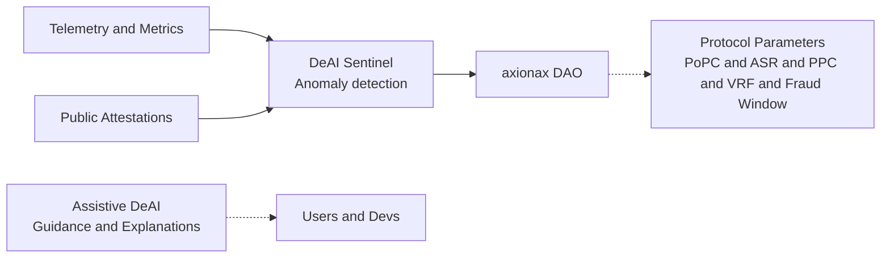

# axionax protocol — Architecture Overview v1.5 (Breakdown)

เอกสารนี้แยกสถาปัตยกรรม axionax ออกเป็นส่วนย่อยตามสรุปเวอร์ชัน 1.5 เพื่อให้เห็นภาพรวมและรายละเอียดของแต่ละองค์ประกอบได้ชัดเจนขึ้น

- วงจร L1 แบบบูรณาการ: Execute → Validate PoPC → Data Availability → Settlement
- ระบบตลาดที่ขับเคลื่อนโดยโปรโตคอล: ASR และ Posted Price Controller
- ความปลอดภัยและความโปร่งใส: Delayed VRF, DA Pre-commit, Stratified + Adaptive Sampling, Replica Diversity, Fraud-Proof Window
- ระบบ DeAI และการกำกับดูแลด้วย DAO
- พารามิเตอร์หลักและเวิร์กโฟลว์ v1.5

---

## 0) High-Level Overview

หมายเหตุ
- เส้นทึบ: เส้นทางข้อมูลหลัก
- เส้นประ: การควบคุม, การตรวจสอบ, และสัญญาณกำกับดูแล

---

## 1) Core Workflow v1.5 (ไม่มีประมูล)

หัวใจ: Post → Assign → Execute → Commit and DA Pre-commit → Wait k → Challenge → Prove → Verify and Seal → Fraud Window → Finalize

---

## 2) ASR — Auto-Selection Router

รายละเอียด
- Suitability: ความเข้ากันได้กับข้อกำหนดงาน
- Performance: ค่าความน่าเชื่อถือเชิงสถิติ (เช่น EWMA 7–30 วัน)
- FairnessBoost: จำกัดโควต้า, newcomer boost แบบ ε-greedy, และ anti-collusion ตาม org/ASN/ภูมิภาค
- พารามิเตอร์หลัก: K, q_max, ε (กำหนดโดย DAO)

---

## 3) Posted Price Controller (PPC)

สูตรปรับราคา (แนวคิด)
- ปรับราคาต่อรอบเพื่อลดความแออัดและรักษาเสถียรภาพ
- พารามิเตอร์โดย DAO: α, β, ขอบเขต p_min ถึง p_max

---

## 4) PoPC — Proof of Probabilistic Checking

แนวคิดสำคัญ
- ลดต้นทุนตรวจสอบเหลือ O(s)
- ปรับ s เพื่อเพิ่มความมั่นใจตามระดับความเสี่ยง

---

## 5) Data Availability (DA) และการตรวจสอบ

หลักการ
- ต้องพร้อมให้ดึงข้อมูลส่วนที่ท้าทายได้เสมอภายในหน้าต่างเวลา Δt_DA
- หากขาดความพร้อม มีบทลงโทษทันที

---

## 6) Security and Anti-Fraud Layer

หมายเหตุ
- สุ่มท้าทายหน่วงเวลา (k บล็อก) ลดโอกาส grinding
- ตรวจแบบแบ่งชั้นและเพิ่มตัวอย่างอัตโนมัติเมื่อพบสัญญาณเสี่ยง
- ทำซ้ำบางส่วนกับความหลากหลายของแหล่งที่มาเพื่อลดการฮั้ว
- มีหน้าต่างพิสูจน์การโกงเพื่อความรับผิดชอบย้อนหลัง

---

## 7) DeAI และ Governance

บทบาท
- DeAI Sentinel: ตรวจจับความผิดปกติ เช่น การเลี่ยงโควต้า, capacity spoof, การฮั้ว
- Assistive DeAI: แนะนำค่าพารามิเตอร์ที่ปลอดภัย, อธิบายการตัดสินใจ, ตรวจจับ determinism drift
- DAO: ปรับพารามิเตอร์สำคัญทั้งหมดของโปรโตคอล

---

## 8) พารามิเตอร์ที่แนะนำ (v1.5)

| พารามิเตอร์ | ค่าที่แนะนำ | คำอธิบาย |
|---|---:|---|
| s (samples) | 600–1500 | จำนวนจุดสุ่มตรวจใน PoPC |
| β (redundancy) | 2–3% | สัดส่วนงานที่ถูกทำซ้ำเพื่อ cross-check |
| K (Top K) | 64 | จำนวนผู้สมัครสูงสุดใน ASR ก่อนสุ่มด้วย VRF |
| q_max (quota) | 10–15% / epoch | โควต้าสูงสุดต่อผู้ให้บริการ |
| ε (epsilon) | 5% | สัดส่วน exploration สำหรับผู้เล่นใหม่ |
| util* | 0.7 | เป้าหมาย utilization ของ PPC |
| q* | 60 วินาที | เป้าหมายเวลารอคิวของ PPC |
| k (delay blocks) | ≥ 2 บล็อก | หน่วงเวลา seed ของ VRF |
| Δt_fraud | ~3600 วินาที | ระยะเวลาของ Fraud-Proof Window |
| False PASS (V) | ≥ 500 bp | อัตราโทษกับ Validator ที่โหวตผ่านงานโกง |

---

## 9) อ้างอิงเวิร์กโฟลว์ v1.5 (ย่อ)

1. โพสต์งาน → 2. ASR Assign → 3. Execute → 4. Commit และ DA Pre-commit → 5. Wait k → 6. Challenge (VRF) → 7. Prove → 8. Verify และ Seal → 9. Fraud Window → 10. Finalize และ Settlement → 11. DeAI Monitor

---

เคล็ดลับการเรนเดอร์ Mermaid บน GitHub
- ใช้ ` ` สำหรับขึ้นบรรทัดใหม่ในป้ายชื่อ
- หากมีวงเล็บในป้ายชื่อ ให้ครอบด้วยเครื่องหมายคำพูด เช่น `Node["Text (extra)"]`
- หลีกเลี่ยงลิงก์สองหัวแบบเส้นประในบรรทัดเดียว ให้ใช้สองบรรทัด `A -.-> B` และ `B -.-> A` แทน
