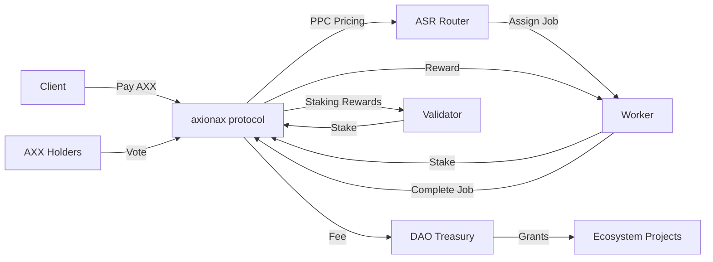

# axionax Tokenomics

## Overview

The AXX token is the native utility token of the axionax protocol, designed to align incentives across all network participants while maintaining long-term sustainability and decentralization.

## Token Supply

- **Total Supply**: 1,000,000,000,000 AXX (1 Trillion)
- **Supply Model**: Fixed cap (no inflation beyond initial distribution)
- **Precision**: 18 decimals

## Token Utilities

### 1. Gas Fees (Transaction Costs)
- All on-chain transactions require AXX for gas
- Dynamic fee market based on network congestion
- Fee burn mechanism (optional, governance-controlled)

### 2. Staking
- **Validators**: Stake AXX to participate in consensus
  - Minimum stake: 100,000 AXX (governance parameter)
  - Slashing for misbehavior
- **Workers**: Stake AXX as collateral for compute jobs
  - Stake amount proportional to job value
  - Slashing for fraud or DA unavailability

### 3. Medium of Exchange
- Workers receive AXX for completed compute jobs
- Clients pay AXX for compute resources
- Settlement via Posted Price Controller (PPC)

### 4. Governance
- AXX holders participate in DAO governance
- Voting power proportional to staked AXX
- Vote on protocol parameters, upgrades, treasury allocation

## Token Allocation (Suggested Distribution)

| Allocation | Percentage | Amount (AXX) | Vesting | Purpose |
|------------|-----------|--------------|---------|---------|
| **Ecosystem Reserve** | 45% | 450,000,000,000 | N/A | Staking rewards, grants, partnerships |
| **Team & Advisors** | 20% | 200,000,000,000 | 4-year linear | Core contributors |
| **Early Investors** | 10% | 100,000,000,000 | 2-year linear | Seed/Private rounds |
| **Public Sale** | 10% | 100,000,000,000 | Immediate | Community distribution |
| **Foundation** | 8% | 80,000,000,000 | 3-year linear | Protocol development |
| **Community Airdrops** | 5% | 50,000,000,000 | Various | Early adopters, testnet participants |
| **Liquidity Provision** | 2% | 20,000,000,000 | Immediate | DEX liquidity |

### Vesting Details

**Team & Advisors (4-year linear)**
- 1-year cliff
- Monthly unlocks after cliff
- Subject to performance milestones

**Early Investors (2-year linear)**
- 6-month cliff
- Monthly unlocks after cliff

**Foundation (3-year linear)**
- No cliff
- Quarterly unlocks
- Transparency reports required

## Emission Schedule

### Staking Rewards
- **Target APY**: ~2.25%
- **Source**: Ecosystem Reserve
- **Distribution**: Proportional to stake and performance
- **Adjustments**: DAO-governed based on network participation

### Reward Distribution
```
Total Rewards per Epoch = Ecosystem Reserve × Emission Rate / Epochs per Year

Validator Reward_i = (Stake_i / Total_Stake) × Total Rewards × Performance_i
Worker Reward_i = Job_Value × (1 - Protocol_Fee) × Quality_Score_i
```

### Performance Metrics
- **Validators**: Uptime, vote participation, DA audit participation
- **Workers**: PoPC pass rate, DA reliability, SLA compliance

## Economic Parameters (Governance-Controlled)

| Parameter | Initial Value | Description |
|-----------|--------------|-------------|
| **Validator Min Stake** | 100,000 AXX | Minimum to become validator |
| **Worker Stake Ratio** | 10-20% | Stake as % of job value |
| **Protocol Fee** | 5% | Fee on compute jobs |
| **Slash Rate (Fraud)** | 100% | Penalty for proven fraud |
| **Slash Rate (DA Fail)** | 50% | Penalty for DA unavailability |
| **Slash Rate (False PASS)** | 500 bp (5%) | Validator voting wrong |
| **Emission Rate** | 2.25% APY | Annual staking yield target |

## Token Flow Diagram



## Fee Structure

### Transaction Fees
- **Base Fee**: Dynamic, adjusted based on network congestion
- **Priority Fee**: Optional tip for faster inclusion
- **Fee Destination**: 50% burn / 50% treasury (governance-controlled)

### Compute Job Fees
```
Total Job Cost = Base Price (PPC) × Job Size + Protocol Fee

Worker Payout = Total Job Cost × (1 - Protocol Fee %) × Quality Multiplier
Protocol Fee → DAO Treasury
```

### Slashing Distribution
```
Slashed Amount = Stake × Slash Rate

Distribution:
- 50% → Fraud reporter / DA auditor (if applicable)
- 30% → DAO Treasury
- 20% → Validator reward pool
```

## Treasury Management

### DAO Treasury Sources
1. Protocol fees from compute jobs (5%)
2. Transaction fees (50% of collected fees)
3. Slashing penalties (30% of slashed amounts)

### Treasury Allocation (Governance-Voted)
- **Grants & Partnerships**: 40%
- **Development Bounties**: 30%
- **Marketing & Community**: 20%
- **Reserve/Emergency Fund**: 10%

## Long-Term Sustainability

### Deflationary Mechanisms (Optional)
- Fee burning (governance-activated)
- Unclaimed reward burning after 1 year

### Growth Incentives
- Early worker bonus (year 1-2): +20% rewards
- Geographic diversity bonus: +10% for underserved regions
- Newcomer boost (ASR ε-greedy): 5% allocation

## Token Metrics (Projected)

### Year 1 (Testnet → Mainnet)
- **Circulating Supply**: ~150B AXX (15%)
- **Staked %**: Target 40-50%
- **Validator Count**: 100+
- **Worker Nodes**: 500+

### Year 3 (Mature Network)
- **Circulating Supply**: ~400B AXX (40%)
- **Staked %**: Target 50-60%
- **Validator Count**: 500+
- **Worker Nodes**: 5,000+

### Year 5 (Fully Distributed)
- **Circulating Supply**: ~800B AXX (80%)
- **Staked %**: Target 50-60%
- **Validator Count**: 1,000+
- **Worker Nodes**: 20,000+

## Governance Parameters Subject to DAO Vote

All economic parameters can be adjusted via governance proposals:
- Staking minimums
- Emission rates
- Protocol fees
- Slashing rates
- Fee burn percentage
- Treasury allocation

## Audits & Compliance

- **Token Contract Audit**: [Pending - Q1'26]
- **Economic Model Review**: [Pending - Q2'26]
- **Legal Opinion**: [Pending - Q2'26]

## References

- Whitepaper v1.5, Section "Tokenomics"
- [Governance Documentation](./GOVERNANCE.md)
- [Security Model](./SECURITY.md)

---

**Note**: Token allocation and economics are subject to change based on DAO governance and regulatory review.

Last Updated: 2025-10-24 | v1.6.0
