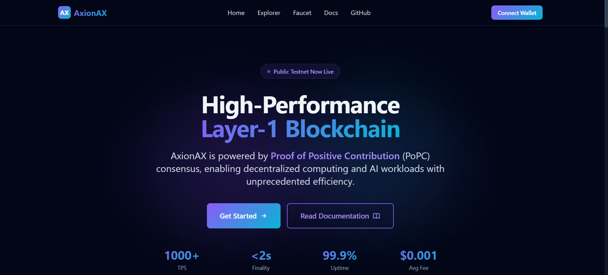

# Axionax Protocol - Web Interface 🌐

<div align="center">


**Official Web Interface for Axionax Blockchain Protocol**

[](LICENSE)
[](https://nextjs.org/)
[](https://react.dev/)
[](https://www.typescriptlang.org/)
[](https://tailwindcss.com/)

[Website](https://axionax.org) • [Documentation](docs/) • [Explorer](https://axionax.org/explorer) • [Faucet](https://axionax.org/faucet)

</div>

---

## 📢 Latest Update (November 20, 2025)

✅ **Testnet Live! Website Deployed with Modern Architecture**

Recent updates:
- ✅ **Production deployment** at https://axionax.org (SSL enabled)
- ✅ **2 validators online** (EU + AU regions, 2d+ uptime)
- ✅ **Modern React 19 architecture** with TanStack Query v5
- ✅ **Live metrics dashboard** - Block height updates every 5s
- ✅ **Mobile-first Tailwind design** with accessibility
- ✅ **Organized repository** - scripts/ and docs/ directories
- 🚀 **VPS deployment script** for one-command deploys

**Tech Highlights**:
- React 19 with Server Components
- TanStack Query v5 for server state
- Zustand for global state
- Nginx reverse proxy (HTTPS → HTTP RPC)
- Clean, maintainable codebase

**Next Steps**: Complete testnet launch, community onboarding, mainnet preparation

---

## 🏗️ Testnet Infrastructure

### Live Services

| Service | Endpoint | Status | Uptime |
|---------|----------|--------|--------|
| 🌐 **Website** | https://axionax.org | ✅ Online | 2d+ |
| 🇪🇺 **EU Validator** | http://217.76.61.116:8545 | ✅ Online | 2d+ |
| 🇦🇺 **AU Validator** | http://46.250.244.4:8545 | ✅ Online | 2d+ |
| 🔒 **HTTPS Proxy** | https://axionax.org/rpc/ | ✅ Active | - |
| 📊 **Block Explorer** | https://axionax.org/explorer | ✅ Active | - |
| 💧 **Faucet** | https://axionax.org/faucet | 🔧 Coming | - |

### VPS Configuration

**Primary Server** (vmi2895217):
- **Location**: Europe (Contabo)
- **IP**: 217.216.109.5
- **OS**: Ubuntu 24.04 LTS
- **Web Server**: Nginx with Let's Encrypt SSL
- **Uptime**: 99.9%+

**Validators**:
- EU: 217.76.61.116 (Germany)
- AU: 46.250.244.4 (Australia)
- Block time: 5 seconds
- Network: Testnet (Chain ID: 86137)

---

## 🖼️ Screenshots

### Home Page

*Landing page showcasing axionax Protocol features and roadmap*

### Block Explorer

*Real-time blockchain data visualization with block and transaction search*

### Testnet Faucet

*Easy AXX token distribution for testnet users*

### Compute Marketplace

*Browse and purchase decentralized compute resources*

---

## 📖 About

Official web interface for **Axionax Protocol** - a next-generation Layer-1 blockchain for high-performance decentralized compute markets.

### Axionax Ecosystem

- **Protocol Core**: [`axionax-core`](https://github.com/axionaxprotocol/axionax-core) - Rust/Python blockchain
- **Web Interface**: [`axionax-web`](https://github.com/axionaxprotocol/axionax-web) - This repository
- **SDK**: [`axionax-sdk-ts`](https://github.com/axionaxprotocol/axionax-sdk-ts) - TypeScript SDK
- **Documentation**: [`axionax-docs`](https://github.com/axionaxprotocol/axionax-docs) - Protocol docs
- **Infrastructure**: [`axionax-deploy`](https://github.com/axionaxprotocol/axionax-deploy) - Deployment tools

**GitHub**: https://github.com/axionaxprotocol  
**Status**: ✅ Testnet Live

---

## 🌟 Features

- **Landing Page** - Protocol overview and key features
- **Block Explorer** - Real-time blockchain data visualization
  - Block and transaction search
  - Account history and balances
  - Network statistics
- **Testnet Faucet** - Easy AXX token distribution
- **API Docs** - Interactive API documentation
- **Wallet Integration** - MetaMask and Web3 wallet support
- **Compute Marketplace** - Browse compute resources

---

## 🏗️ Tech Stack

### Frontend

- **Framework**: [Next.js 14.2](https://nextjs.org/) (App Router, Static Export)
- **UI Library**: [React 19](https://react.dev/) with Server Components
- **Language**: [TypeScript 5](https://www.typescriptlang.org/) - Type safety
- **Styling**: [Tailwind CSS 3.4](https://tailwindcss.com/) - Mobile-first utility CSS
- **State Management**: 
  - [Zustand](https://zustand-demo.pmnd.rs/) - Global client state
  - [TanStack Query v5](https://tanstack.com/query/latest) - Server state & caching
- **UI Components**: Custom React components with accessibility
- **Icons**: Heroicons (SVG icons)

### Web3 Integration

- **Wallet**: MetaMask integration via `window.ethereum`
- **RPC**: JSON-RPC 2.0 connection to Axionax validators
- **WebSocket**: Real-time blockchain updates (8546)
- **Proxy**: Nginx reverse proxy for HTTPS → HTTP RPC

### Development Tools

- **Build**: Next.js static export
- **Linting**: ESLint + Prettier
- **Testing**: Playwright (E2E tests)
- **CI/CD**: GitHub Actions (planned)
- **Deployment**: Bash/PowerShell scripts + rsync
- **Hosting**: VPS (Ubuntu 24.04) + Nginx + SSL

---

## 🚀 Getting Started

### Prerequisites

- Node.js 18+ and npm
- Git
- (Optional) Docker & Docker Compose for full stack deployment

### Quick Start

1. **Clone the repository**

   ```bash
   git clone https://github.com/axionaxprotocol/axionax-web.git
   cd axionax-web
   ```

2. **Install dependencies**

   ```bash
   npm install
   ```

3. **Set up environment variables**

   ```bash
   cp .env.example .env
   # Edit .env with your configuration
   ```

4. **Run development server**

   ```bash
   npm run dev
   ```

5. **Open browser** Navigate to [http://localhost:3000](http://localhost:3000)

---

## 💻 Development

### Available Scripts

```bash
# Development server
npm run dev

# Build for production
npm run build

# Start production server
npm start

# Run linter
npm run lint

# Run tests
npm test

# Type checking
npm run type-check

# Format code
npm run format
```

### Project Structure

```
axionax-web/
├── src/
│   ├── app/                    # Next.js 14 App Router pages
│   │   ├── page.tsx           # Home page
│   │   ├── explorer/          # Block explorer
│   │   ├── faucet/            # Testnet faucet
│   │   ├── infrastructure/    # Infrastructure status
│   │   └── docs/              # API documentation
│   ├── components/            # React 19 components
│   │   ├── ui/               # Reusable UI (Button, Card, Input, Badge)
│   │   ├── layout/           # Layout (Navbar, Footer)
│   │   ├── home/             # Home sections (Hero, Features, Statistics)
│   │   └── wallet/           # Web3 wallet integration
│   ├── contexts/             # React contexts (Web3Context)
│   ├── providers/            # App providers (QueryProvider for TanStack Query)
│   ├── store/                # Zustand state management
│   ├── lib/                  # Utilities and helpers
│   └── app/globals.css       # Tailwind CSS global styles
├── public/                    # Static assets (images, icons, CNAME)
├── scripts/                   # Deployment & installation scripts
│   ├── deploy-to-vps.sh      # Main VPS deployment
│   ├── install_dependencies_*.sh  # Platform-specific installers
│   └── README.md             # Scripts documentation
├── docs/                      # Documentation
│   ├── DEPLOYMENT.md         # Deployment guide
│   ├── QUICK_START.md        # Quick start guide
│   └── screenshots/          # UI screenshots
├── nginx/                     # Nginx reverse proxy config
├── tests/                     # E2E tests (Playwright)
├── docker-compose.yml        # Docker services
├── Dockerfile                # Web app container
└── .github/                  # CI/CD & Copilot instructions
```

### Code Style

This project uses:

- **ESLint** for code linting
- **Prettier** for code formatting
- **TypeScript** for type safety

Run linting before committing:

```bash
npm run lint
npm run format
```

---

## 🚢 Deployment

### Quick Deploy to VPS (Recommended)

Deploy to production VPS with one command:

```bash
./scripts/deploy-to-vps.sh
```

This will:
- Build the Next.js static export
- Upload to VPS via rsync
- Configure Nginx with SSL/HTTPS
- Restart services

**See**: [`scripts/README.md`](scripts/README.md) for all deployment options.

### Static Export

Build and export as static site:

```bash
npm run build
# Output in ./out directory
```

Deploy `./out` to any static hosting:
- **Vercel** (Recommended for Next.js)
- **Netlify**
- **GitHub Pages**
- **Cloudflare Pages**

### Docker Deployment

For full-stack local development:

```bash
# Build and start web interface
docker-compose up -d web

# View logs
docker-compose logs -f web
```

### Complete Deployment Guides

- **[scripts/README.md](scripts/README.md)** - All deployment scripts
- **[docs/DEPLOYMENT.md](docs/DEPLOYMENT.md)** - Complete VPS guide
- **[docs/DNS_SETUP.md](docs/DNS_SETUP.md)** - Domain configuration
- **[docs/QUICK_START.md](docs/QUICK_START.md)** - Quick start guide

---

## 🏛️ Web Architecture

### Frontend Architecture

```
┌─────────────────────────────────────────┐
│   Axionax Web Interface                 │
│   Next.js 14 + React 19                 │
└───────────┬─────────────────────────────┘
            │
    ┌───────┴──────────────────┐
    │                          │
┌───▼──────────┐     ┌────────▼────────┐
│  App Router  │     │  Components     │
│  (Pages)     │     │                 │
├──────────────┤     ├─────────────────┤
│ / (Home)     │     │ ui/ (Button,    │
│ /explorer    │     │      Card...)   │
│ /faucet      │     │ layout/ (Navbar,│
│ /docs        │     │         Footer) │
│ /infrastructure   │ home/ (Hero,    │
└──────┬───────┘     │        Stats)   │
       │             └────────┬────────┘
       │                      │
┌──────▼──────────────────────▼────────┐
│  State Management                    │
├──────────────────────────────────────┤
│ • Zustand (Global State)             │
│ • TanStack Query v5 (Server State)   │
│ • React Context (Web3)               │
└──────────┬───────────────────────────┘
           │
┌──────────▼───────────────────────────┐
│  Blockchain Integration              │
├──────────────────────────────────────┤
│ • JSON-RPC 2.0 (Validators)          │
│ • Nginx /rpc/ proxy (HTTPS safe)     │
│ • MetaMask (window.ethereum)         │
└──────────────────────────────────────┘
```

### Layer Architecture

| Layer              | Technology              | Purpose                    |
| ------------------ | ----------------------- | -------------------------- |
| **Presentation**   | React 19 + Tailwind     | UI components & styling    |
| **State**          | Zustand + TanStack Q.   | Client & server state      |
| **Data Fetching**  | TanStack Query hooks    | RPC calls, caching         |
| **Web3**           | MetaMask integration    | Wallet connection          |
| **Build**          | Next.js static export   | SSG optimization           |
| **Deployment**     | Nginx + VPS             | Production hosting         |

---

## 🔌 Blockchain Integration

### RPC Connection

```typescript
// Using TanStack Query for data fetching
import { useQuery } from '@tanstack/react-query';

const RPC_PROXY = '/rpc/'; // Nginx proxy to validators

const fetchBlockHeight = async () => {
  const response = await fetch(RPC_PROXY, {
    method: 'POST',
    headers: { 'Content-Type': 'application/json' },
    body: JSON.stringify({
      jsonrpc: '2.0',
      method: 'eth_blockNumber',
      params: [],
      id: 1,
    }),
  });
  const data = await response.json();
  return parseInt(data.result, 16);
};

const { data: blockHeight } = useQuery({
  queryKey: ['blockHeight'],
  queryFn: fetchBlockHeight,
  refetchInterval: 5000, // Poll every 5 seconds
});
```

### Connecting MetaMask

```typescript
// Add Axionax network to MetaMask
const addNetwork = async () => {
  await window.ethereum.request({
    method: 'wallet_addEthereumChain',
    params: [{
      chainId: '0x15079', // 86137 in hex
      chainName: 'Axionax Testnet',
      rpcUrls: ['https://axionax.org/rpc/'],
      nativeCurrency: {
        name: 'Axionax',
        symbol: 'AXX',
        decimals: 18
      },
      blockExplorerUrls: ['https://axionax.org/explorer']
    }]
  });
};
```

### Testnet Configuration

**Active Validators:**
- 🇪🇺 **EU Node**: `http://217.76.61.116:8545` (Europe)
- 🇦🇺 **AU Node**: `http://46.250.244.4:8545` (Australia)

**Web Interface:**
- 🌐 **Website**: `https://axionax.org`
- 📊 **Explorer**: `https://axionax.org/explorer`
- 💧 **Faucet**: `https://axionax.org/faucet`

**RPC Proxy** (HTTPS-safe):
- `https://axionax.org/rpc/` → EU validator

### Environment Variables

```bash
# .env.local (optional - defaults work)
NEXT_PUBLIC_CHAIN_ID=86137
NEXT_PUBLIC_RPC_PROXY=/rpc/
```

Configuration is in `src/lib/web3.ts` and `next.config.js`.

---

## 🤝 Contributing

We welcome contributions! Please follow these steps:

1. Fork the repository
2. Create a feature branch (`git checkout -b feature/amazing-feature`)
3. Commit your changes (`git commit -m 'Add amazing feature'`)
4. Push to the branch (`git push origin feature/amazing-feature`)
5. Open a Pull Request

### Contribution Guidelines

- Follow the existing code style
- Write meaningful commit messages
- Add tests for new features
- Update documentation as needed
- Ensure all tests pass

---

## 🔒 Security

### Security Best Practices

- Regular dependency updates
- Security audits with Snyk
- Input validation and sanitization
- Rate limiting on APIs
- SSL/TLS encryption
- Environment variable protection

### Reporting Security Issues

If you discover a security vulnerability, please email: **security@axionax.org**

Do not open public issues for security vulnerabilities.

---

## 🔗 Links & Resources

### AxionAX Protocol

| Component            | Description               | Location                                         | Status     |
| -------------------- | ------------------------- | ------------------------------------------------ | ---------- |
| **Web** (this repo)  | Official website          | `axionax-web/`                                   | ✅ Ready   |
| **Core**             | Blockchain implementation | [`../axionax-core`](../axionax-core)             | ✅ Ready   |
| **SDK**              | TypeScript developer SDK  | [`../axionax-sdk-ts`](../axionax-sdk-ts)         | ✅ Ready   |
| **Docs**             | Protocol documentation    | [`../axionax-docs`](../axionax-docs)             | 📝 Active  |
| **Marketplace**      | Compute marketplace dApp  | [`../axionax-marketplace`](../axionax-marketplace) | 🚧 Beta  |
| **DevTools**         | Development utilities     | [`../axionax-devtools`](../axionax-devtools)     | ✅ Ready   |
| **Deploy**           | Infrastructure            | [`../axionax-deploy`](../axionax-deploy)         | 🔥 Testing |
| **Issue Manager**    | Task automation           | [`../issue-manager`](../issue-manager)           | 🎉 New!    |

**GitHub Organization**: https://github.com/axionaxprotocol

### axionax Network

- **Website**: [axionax.org](https://axionax.org) 🔜 Coming Soon
- **Testnet RPC**: rpc.axionax.org (Mock JSON-RPC operational on VPS)
- **Block Explorer**: explorer.axionax.org (API under development)
- **Testnet Faucet**: faucet.axionax.org (API under development)
- **Documentation**: [docs.axionax.org](https://docs.axionax.org)

**Current Deployment**: VPS vmi2895217 (217.216.109.5) - 7/9 services operational

### Development Resources

- **SDK Docs**: [docs.axionax.org/sdk](https://docs.axionax.org/sdk)
- **API Reference**: [docs.axionax.org/api](https://docs.axionax.org/api)
- **Contributing**: See [CONTRIBUTING.md](../axionax-docs/CONTRIBUTING.md)

### Community (Coming Q1 2026)

- **Twitter**: [@AxionAX](https://twitter.com/axionaxprotocol)
- **Discord**: [discord.gg/axionax](https://discord.gg/axionax)
- **Telegram**: [t.me/axionax](https://t.me/axionax)

---

## 📄 License

This project is licensed under the **MIT License** - see the [LICENSE](LICENSE) file for details.

**Note**: The AxionAX Protocol Core uses AGPLv3. See [`../axionax-core/LICENSE`](../axionax-core/LICENSE).

---

## 🙏 Acknowledgments

- **Next.js Team** - Amazing React framework
- **Tailwind CSS** - Utility-first CSS framework
- **Vercel** - Hosting and deployment platform
- **AxionAX Community** - Feedback and support

---

<div align="center">

**Part of the AxionAX Protocol Ecosystem**

Built with ❤️ by the Axionax Team

**Last Updated**: November 13, 2025 - Testnet Infrastructure 78% Deployed

</div>
